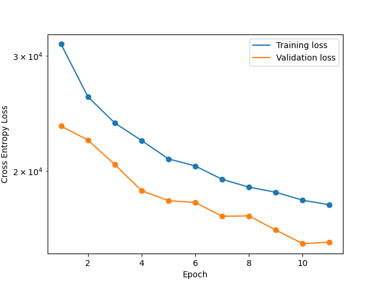

### Project Title

Xavier Boluna

#### Executive summary

This project uses the ResNet Convolutional Neural Network to classify content of sexual nature. Accurately identifying (and quarantining) such content is crucial for moderating online spaces with exposure to wide sectors of society.

The goal of this project is to accurately differentiate NSFW content from non-NSFW "neutral" content. In the course of this project, we produce a tertiary classification. "somewhat NSFW", which encapsulates the nebulous third class which tends generally with content that is NSFW in nature. This three-tier classification system allows for automatic systems to calibrate a response level. Clearly NSFW content would be marked as such, whereas a user may be prompted to self-moderate content that is "somewhat NSFW".

Generally, the goal of the project is to minimize the false-negative count for NSFW content.

An accurate classifier would save a huge number of man-hours otherwise dedicated to moderating online content.

#### Rationale
This project is developed with a social media platform in mind. For this reason, it's important to segregate NSFW content in order to 1) protect sensitive (underage) users, 2) mantain a professional image to continue courting advertisers and, 3) ensure that customers are able to customize their feed in the way they choose.

#### Research Question
Primarily, we are interested in minimizing false negatives (NSFW images which are mislabelled as "neutral") while maintaining a high level of accuracy (not misclassifying images, in general).

#### Data Sources
We employ the use of a [webscraper](https://github.com/alex000kim/nsfw_data_scraper) to collect a wide corpus of NSFW and non-NSFW images. Due to computing constraints, we (for now) neglect to classify NSFW and non-NSFW drawings. We also subset the entire dataset, using ~70,000 of the available images (the entire dataset numbers ~>100,000).

This dataset is quite noisy (there are many misclassified labels). I chose not to manually parse through and clean this data, partially because there are so many images and partially because it's genuinely disconcerting to parse through so much NSFW content.

Many of the images were corrupted as they are datascraped raw from websites. I wrote a small program to validate their integrity.

#### Methodology
In order to mitigate the effect of noise in the dataset, I adopted a relatively low learning rate and applied a number of transforms, including random-crop, rotation and flipping, in addition to normalization. This random transformation also allows for maximum learning on a (slightly) smaller dataset and provides some regularization.

I made sure to split the dataset into three section: training, testing and validation. The testing portion is a very small subset which allows us to compute loss at each epoch. The validation set is reserved to compute the total accuracy of the dataset.

I used ResNet18 with no pre-trained weights, and modified the input and output layers 3-channel RGB and 3-node mutually exclusive output, respectively.

I used Cross Entropy as a the loss criterion, and opted for the Adam optimizer to improve efficiency over ordinary Stochastic Gradient Descent.

I allowed for fitting to run for as many epochs as necessary until the validation error reached its minima and began to rise again. Though it may have been possible, it already took quite enough time for this to occur and I chose not to wait for the possibility of double descent.

#### Results

The model takes quite a while to fit and its progress is ongoing. The current iteration achieves a 100% accuracy with identifying false negatives on the TEST dataset only. Validation will be performed once fine-tuning is complete. At which point, I will:

- Calculate of a confusion matrix. This will allow us to determine the number of false negatives -- the metric we want to minimize most.
- Though we softmax our prediction vector when calculating loss, we can test the activation of the other output nodes with different sample images, to test the viability of using a threshold in the "somewhat NSFW" node to identify difficult-to-classify content.

#### Outline of project

- verify_images.py : Verifies the integrity of images in the dataset and deletes any that are empty/truncated.
- Infrastructure.py : Holds a custom dataloader and wrapper for ResNet18 (inspired by my code for a [Captcha Breaker](https://github.com/CaptchaOCR/CNN))
- run_fitting.py : Run the fit. Loads data, manages logs, etc.
- ResultsAnalysis.ipynb : Will be included in next push.
