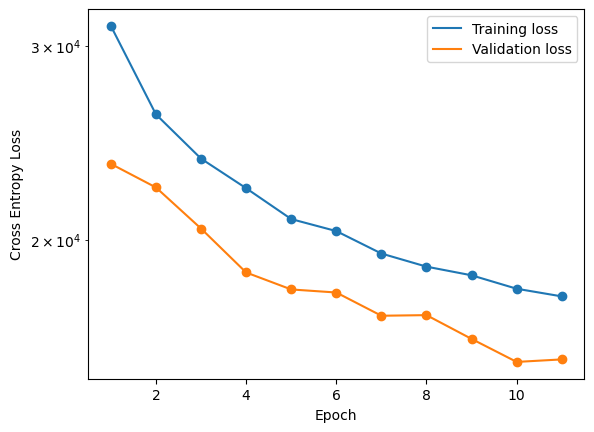
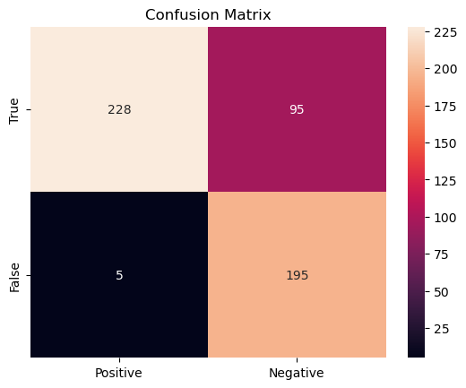

### Project Title

Xavier Boluna

#### Executive summary

This project uses the ResNet Convolutional Neural Network to classify content of sexual nature. Accurately identifying (and quarantining) such content is crucial for moderating online spaces with exposure to wide sectors of society.

The goal of this project is to accurately differentiate NSFW content from non-NSFW "neutral" content. In the course of this project, we produce a tertiary classification. "somewhat NSFW", which encapsulates the nebulous third class which tends generally with content that is NSFW in nature. This three-tier classification system allows for automatic systems to calibrate a response level. Clearly NSFW content would be marked as such, whereas a user may be prompted to self-moderate content that is "somewhat NSFW".

Generally, the goal of the project is to minimize the false-negative count for NSFW content.

An accurate classifier would save a huge number of man-hours otherwise dedicated to moderating online content.

#### Rationale
This project is developed with a social media platform in mind. For this reason, it's important to segregate NSFW content in order to 1) protect sensitive (underage) users, 2) mantain a professional image to continue courting advertisers and, 3) ensure that customers are able to customize their feed in the way they choose.

#### Research Question
Primarily, we are interested in minimizing false negatives (NSFW images which are mislabelled as "neutral") while maintaining a high level of accuracy (not misclassifying images, in general).

#### Data Sources
We employ the use of a [webscraper](https://github.com/alex000kim/nsfw_data_scraper) to collect a wide corpus of NSFW and non-NSFW images. Due to computing constraints, we (for now) neglect to classify NSFW and non-NSFW drawings. We also subset the entire dataset, using ~70,000 of the available images (the entire dataset numbers ~>100,000).

This dataset is quite noisy (there are many misclassified labels). I chose not to manually parse through and clean this data, partially because there are so many images and partially because it's genuinely disconcerting to parse through so much NSFW content.

Many of the images were corrupted as they are datascraped raw from websites. I wrote a small program to validate their integrity.

#### Methodology
In order to mitigate the effect of noise in the dataset, I adopted a relatively low learning rate and applied a number of transforms, including random-crop, rotation and flipping, in addition to normalization. This random transformation also allows for maximum learning on a (slightly) smaller dataset and provides some regularization.

I made sure to split the dataset into three section: training, testing and validation. The testing portion is a very small subset which allows us to compute loss at each epoch. The validation set is reserved to compute the total accuracy of the dataset.

I used ResNet18 with no pre-trained weights, and modified the input and output layers 3-channel RGB and 3-node mutually exclusive output, respectively.

We chose to use simple Cross Entropy Loss and the Adam optimizer to train a single classification per image and make use of our "smaller" dataset. The dataset is quite noisy, meaning that many images are generally misclassified. For this reason, we employ as large of a dataset as possible and restrict the learning rate to a conservative 1e-3. We will instead run the model for a larger number of epochs to mitigate this effect. We also choose to stratify the dataset per batch. This does bias images with fewer samples (namely the NSFW images), however this allows for more balanced loss calculations per epoch. Lastly, we apply several transformations to each image to ensure that the image reading is random.

I allowed for fitting to run for as many epochs as necessary until the validation error reached its minima and began to rise again. Though it may have been possible, it already took quite enough time for this to occur and I chose not to wait for the possibility of double descent.

#### Results

As is evident, the training loss continues decreasing whereas the validation loss reaches a minimum and begins to climb again. The fitting process is halted and the model state reverted to that of the minimum validation loss. At this point, the model is fitted and we can begin testing the model's performance.

Following our business objective, we develop three criteria. One has already been seen -- raw accuracy encapsulates the ability for the model to differentiate NSFW images. Second, we want to calculate the false-negative rate. Missing out on images that should otherwise be classified as NSFW could be damaging to the business' reputation. Lastly, we want to calculate the false-positive rate. We want to understand how often customers' images are incorrectly flagged as NSFW, as this has ramifications for either frustration for the customer or increased man-hours to remediate the situation.
To this end, it is easiest to build a confusion matrix, and calculate the respective rates from there.

As per our business objective, our main criteria is to accurately tag "NSFW" and "provocative" images. Of course, we build two separate criteria as these classes can often look quite different. Nonetheless, we evaluate accuracy on the basis of accurately predicting a binary class in  which NSFW: ['nsfw', 'provocative'] and Non-NSFW: 'neutral' only.

In the subsequent section, I transferred a random subset of the images in the validation set to a separate directory. It should be noted that, across the entire validation set, the accuracy score is 85%. However, in subsetting the validation set, the accuracy is expected to change significantly as the noise in the dataset is still present.

Our model performs on the test data with a total accuracy of 80%. The false-negative rate is roughly 30% -- not a great score. In comparison, the false-positive rate is less than 2.5%. Clearly, this reflects the much larger "neutral" dataset, which allows for more variability in the dataset.

Following these results, we can make some conclusions on improvements for the future.

First, a larger dataset would definitely improve results -- especially a more even distribution of photos among the classes. I tried to rectify this issue with stratification and a image transformations, but clearly the model was not able to improve its false-negative rate sufficiently. This false-negative rate is one of our main deliverables, so it should be prioritized.

To this end: with more time, I would have experimented with penalizing false negatives by optimizing for recall. This could be a post-train tuning of the model, to avoid lowering precision unnecessarily.

All-in-all, however we can assess the value of adding this feature to our model as it is. Assessing on the basis of the accuracy, we can predict a reduction of >20% human involvement with content moderation. The relatively few false positive reduce the need for humans to remediate incorrectly-flagged content. Due to the high false-negative rate, however, we would still require human moderation.

#### Outline of project

- verify_images.py : Verifies the integrity of images in the dataset and deletes any that are empty/truncated.
- Infrastructure.py : Holds a custom dataloader and wrapper for ResNet18 (inspired by my code for a [Captcha Breaker](https://github.com/CaptchaOCR/CNN))
- run_fitting.py : Run the fit. Loads data, manages logs, etc.
- ResultsAnalysis.ipynb : Will be included in next push.
- Two images, containing the loss curves and the resulting confusion matrix.
